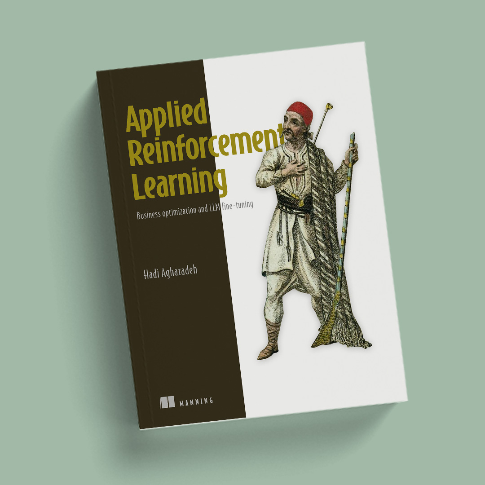

# Applied Reinforcement Learning

### From Business Optimization to LLM Fine-Tuning

<a href="https://www.manning.com/books/applied-reinforcement-learning">
  
</a>

This is the official code repository for [**Applied Reinforcement Learning**](https://www.manning.com/books/applied-reinforcement-learning), published by Manning Publications.

Reinforcement learning (RL) is one of the most powerful paradigms in machine learning for sequential decision making, yet most resources focus on games and simulations. This book bridges the gap between RL theory and real-world applications, showing you how to formulate, model, and solve practical optimization problems using RL — from warehouse logistics and dynamic pricing to treatment optimization and large language model fine-tuning.

Whether you are a data scientist, ML engineer, operations researcher, or software developer, this book equips you with a hands-on toolkit to apply RL to the kinds of messy, constrained, high-stakes problems you encounter in industry.

---

## What You Will Learn

- How to frame real-world business problems as Markov Decision Processes
- Designing custom RL environments with domain-specific constraints and reward engineering
- Classical and tabular RL methods: Dynamic Programming, Bandits, Q-Learning, SARSA, and Monte Carlo Tree Search
- Deep RL with DQN and Policy Gradient methods for high-dimensional problems
- Fine-tuning Large Language Models using PPO, GRPO, and RLVR

---

## Table of Contents and Code

### Part 1: Fundamentals — Building a Reinforcement Learning Toolkit

| Chapter | Title | Code |
|---------|-------|------|
| 1 | Real-World Decision Making with Reinforcement Learning | — |
| 2 | Markov Decision Process: Turning Problems into Solvable Models | [Chapter 2](Chapter2/) |
| 3 | Design Custom Environments for Reinforcement Learning Algorithms | [Chapter 3](Chapter3/) |

### Part 2: Reinforcement Learning for Business Optimization

| Chapter | Title | Code |
|---------|-------|------|
| 4 | Perfect Knowledge, Optimal Policy: Dynamic Programming | [Chapter 4](Chapter4/) |
| 5 | Contextual Bandit: Optimizing Stochastic One-Step Decisions | [Chapter 5](Chapter5/) |
| 6 | Tabular Reinforcement Learning | [Chapter 6](Chapter6/) |
| 7 | Monte Carlo Tree Search: Searching with RL Principles | [Chapter 7](Chapter7/) |

### Part 3: Deep Reinforcement Learning for Business Optimization

| Chapter | Title | Code |
|---------|-------|------|
| 8 | Deep Q-Networks for High-Dimensional Data | [Chapter 8](Chapter8/) |
| 9 | The Calculus of Decisions: Policy Gradient Methods | [Chapter 9](Chapter9/) |

### Part 4: Reinforcement Learning for Large Language Model Fine-Tuning

| Chapter | Title | Code |
|---------|-------|------|
| 10 | Fine-Tuning Large Language Models with PPO | Coming soon |
| 11 | Reinforcement Learning with Human Feedback Using GRPO | Coming soon |
| 12 | RLVR and Advanced PPO Methods for LLM Reasoning | Coming soon |

---

## Hands-On Projects

Throughout the book you will build and solve real-world optimization problems, including:

- **Warehouse Order Picking** — Design an RL environment for a robot navigating a warehouse grid to fulfill orders efficiently.
- **Perishable Product Dynamic Pricing** — Train an agent to set optimal prices for products with limited shelf life.
- **Trailer Loading and Packing** — Solve 3D bin-packing problems to maximize trailer space utilization.
- **Resource Allocation with Dynamic Programming** — Find optimal policies for constrained resource distribution.
- **Ad Campaign Optimization with Bandits** — Balance exploration and exploitation for personalized ad targeting and dynamic discounting.
- **Gas Station Fuel Purchase Scheduling** — Use Q-Learning and SARSA to minimize fuel purchasing costs over time.
- **Capacitated Vehicle Routing (CVRP)** — Solve vehicle routing problems with Monte Carlo Tree Search.
- **Treatment Optimization with DQN** — Apply Deep Q-Networks to sequential treatment decision making.
- **Data Center Cooling Optimization** — Use REINFORCE with Transformer-based policies to optimize energy consumption.
- **LLM Fine-Tuning with PPO, GRPO, and RLVR** — Align and improve large language model reasoning using modern RL techniques.

---

## Getting Started

### Prerequisites

- Python 3.10+
- Jupyter Notebook

### Installation

```bash
git clone https://github.com/hadiagha/rl-business-optimization.git
cd rl-business-optimization
pip install -r requirements.txt
```

---

## About the Book

[**Applied Reinforcement Learning**](https://www.manning.com/books/applied-reinforcement-learning) is published by [Manning Publications](https://www.manning.com/). You can purchase the book or access the MEAP (Manning Early Access Program) at:

**[https://www.manning.com/books/applied-reinforcement-learning](https://www.manning.com/books/applied-reinforcement-learning)**

---

## About the Author

**Hadi Aghazadeh** is a Senior Data Scientist at Enverus, where he builds machine learning, optimization, and AI systems for large-scale forecasting and decision-making in energy. Before joining Enverus, he was a Machine Learning Engineer at Bits In Glass, developing AI and generative AI solutions for real-world business challenges. Over the course of more than seven years, he has led and contributed to projects in reinforcement learning, optimization, fraud detection, dynamic pricing, supply chain decision-making, and logistics.

He holds a PhD from the University of Calgary, where his research explored how reinforcement learning and operations research can solve large-scale planning and scheduling problems. His work has been published in *Transportation Research Part C* and presented at conferences including ACM KDD and ACM SIGSPATIAL.

Hadi is especially interested in closing the gap between theory and practice: taking ideas that work in papers and making them work under real operational pressure. He has received several distinctions for his work, including first place in the AMII Reinforcement Learning Competition and the Alberta Innovates Scholarship.

---

## License

The code in this repository is provided for educational purposes to accompany the book. Please refer to the [Manning license](https://www.manning.com) for terms of use.
